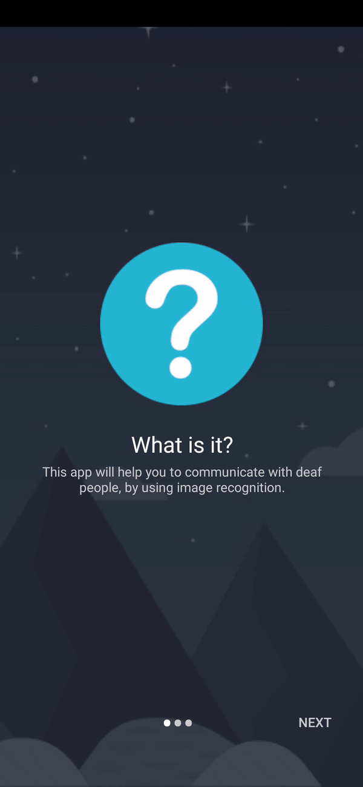
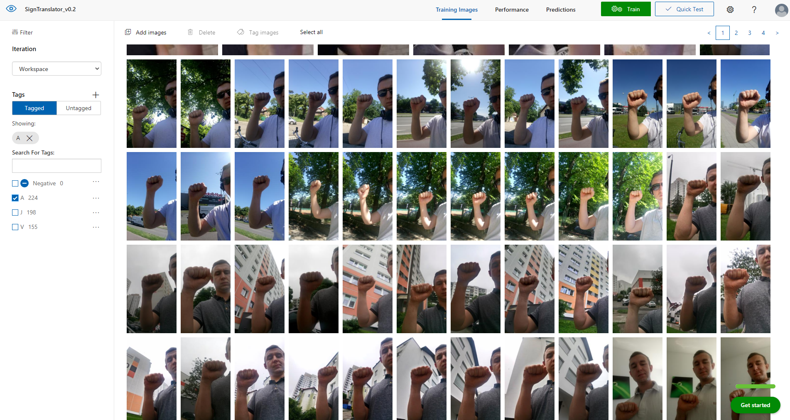

# SignTranslator
>Sign translator is a mobile application develop on Android System. It its a translator for sign language. Was created for help to communicate with deaf people. This tool can translate from sign to english and english to sign language. In this readme i demonstrate how to implemnt and use by yourself.


## Table of contents
* [General info](#general-info)
* [Screenshots](#screenshots)
* [Technologies](#technologies)
* [Setup](#setup)
* [Features](#features)
* [Status](#status)
* [Contact](#contact)


## General info
How this work? Its quite simple. English to sign translation is based on graphic sings. App is recognizing and match each letter to graphic sing, then present it to user. Sign language to english is more difficult. At first user should take photo of his hand(sign), application save it into file then throught REST API send it into Azure platform where is all magic done. Azure platform shares Custom Vision AI with can be trained to classyfy images in this case our photos. We can create there tags for each sign and train it to classyfy our photos to each signs (tag). As return we orbtain JSON with percentage classyfy to what tag (sign) our photo is match most. At the end we can decide what should we do with our result its mean, we can show to user result or tell thats we dont recognize sign. 


## Screenshots
<p align="center">
 
 
</p>


# Technologies
* Azure AI Custom Vision
* Android Studio
* Java
* Camera
* REST OkHttp3


## Setup

### Setup Azure AI 
  1. Create account on [Azure](https://azure.microsoft.com/)
  2. Login and create project on [CustomVision](https://www.customvision.ai/)
  3. Create Tags for each letter
  4. Each tag should be filled with at least 200 photos of sing. Photos should be different for better AI training
  
<p align="center"></p>

  5. Train yours AI 
  6. Copy and save prediction endpoint data
  
### Setup app
  1. Clone repo and change inside values/string.xml for yours prediction data
  
  ```xml
    <resources>    
        <string name="PredictionEndpoint">YOURS_ENDPOINT</string>
        <string name="PredictionKey">API_KEY</string>
        <string name="PredictionIterationName">YOURS_NAME</string>
    </resources>
```

  2. Voilà its is working :)


## Features
* English to sing translation
* Sing to english translation


## Status
Finished


## Contact
Feel free to contact Adrian Wozniak (adrianwozniak576@gmail.com)

